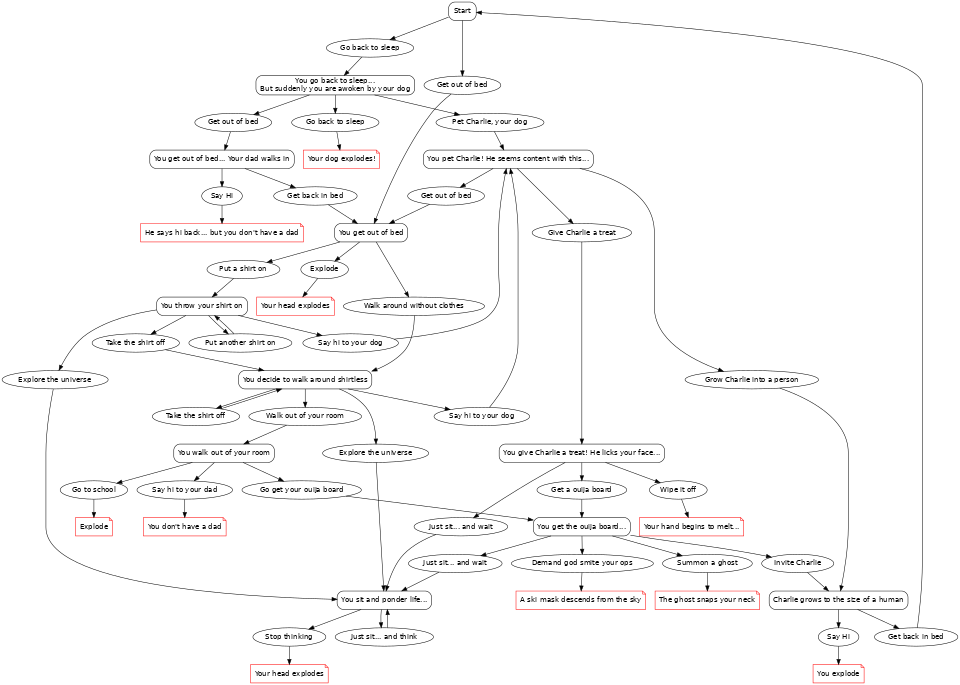

[](https://classroom.github.com/a/iDZRBYvt)



# Life Decision
Life Decision is a surreal, text-based decision game that throws the player into a bizarre simulation of waking life — where every mundane choice (like getting out of bed or petting your dog Charlie) can spiral into the unexpected, the absurd, or the metaphysical.

You'll navigate dream logic, existential dread, ghost summoning, and exploding dogs in a branching narrative where no decision is safe, and reality is... negotiable.

 


## Requirements
* Python 3.x
* A keyboard

## Features
* Ask not what your dog can do for you, twin 🥀 — pet him, and see what happens
* We choose to go back to sleep not because it is easy, but because consciousness is hard
* Let the record show: Charlie did not lick your face to be liked, but to test your resolve, twin 🥀
* Mankind must put on a shirt not because it is cold, but because dignity demands it
* And yet, twin 🥀, we also walk shirtless into the unknown — for freedom
* In the space race between bed and getting out of it, your father will not be present
* The only thing we have to fear... is wiping dog slobber off your melting face
* Let every Ouija board go forth as a trumpet of terror — summoning only ghosts and regret
* Grow your dog into a man, twin 🥀, not because science can — but because you must
* The torch has been passed to a new generation — and then dropped, exploded, and re-lit by a spectral ski mask
* Victory will not be found in school — only instant combustion
* We sit and stew, not in defeat, but in contemplation — eternal, looping, deeply unproductive
* We shall explode in bedrooms, we shall explode in hallways, we shall never surrender
* The right to say “Hi” to a ghost shall not be infringed, twin 🥀
* This is your room. You can leave it. But only once
* Your decisions may be absurd, but they are free — and freedom is never free
* You walk without clothes because the Constitution does not say you can’t
* If we must melt, then let it be with courage, twin 🥀
* There comes a time when every man must decide whether to get out of bed, or explode trying
* To those who dare sit and think... I say: you are the real pioneers
* We do these things not because they are reasonable, but because they are deeply cursed
* Let the axis of absurdity tremble before your decision tree
* A human being is not defined by clothes, but by how many shirts they can stack
* The time is now, twin 🥀 — choose your destiny, then immediately perish

## Examples

Basic usage:

```bash
python3 decision_tree.py
```
## License
This project is public domain.
